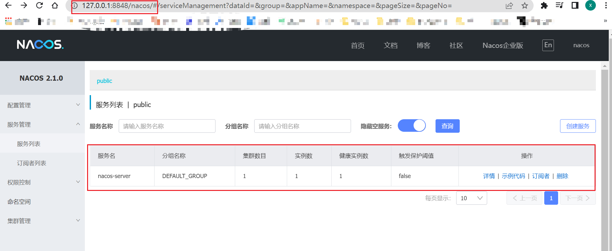
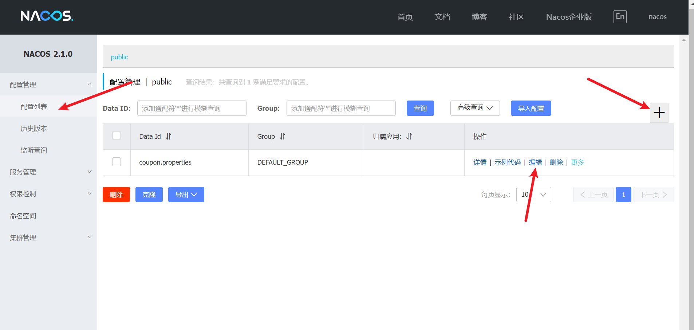
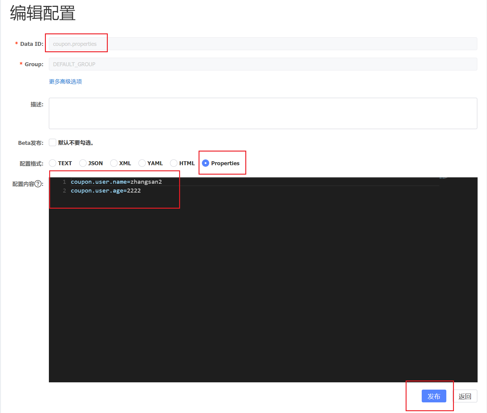

# 微服务学习记录

## 1 nacos

### 1.1 nacos-server启动问题：

直接双击启动会报错

 ```sh
 Unable to start embedded Tomcat
 ```

修改 `/nacos/bin/startup.cmd` 将其中**Mode** 的原先的 cluster改成 standalone，即可重新开启

### 1.2 注册

1. 每个服务在配置文件中填写nacos-server的信息及自身服务名

```yml
spring:
  cloud:
    nacos:
      discovery:
        server-addr: 127.0.0.1:8848
  application:
    name: nacos-server
```

2. 在启动程序上标上微服务客户端注解

```java
// 此注解
@EnableDiscoveryClient
@SpringBootApplication
public class NacosServerApplication {
    public static void main(String[] args) {
        SpringApplication.run(NacosServerApplication.class, args);
    }
}

```

### 1.3 登录nacos服务器web查看

`url: 127.0.0.1:8848/nacos`



## 2 Feign

> feign 是用来在各服务之间进行通信的

在需要调用其他服务的主程序上开启feign注解 `@EnableFeignClients(basePackages = "com.wx.feign")`并将调用的包的路径添加进来

在编写的实际调用远程的接口的接口上标注上 注解 `@FeignClient`，并在具体的方法上标注出该被调用方法的详细路径：如下`/coupon/coupon/member/list`

```java
@FeignClient("coupon")
public interface CouponFeignService {
    @RequestMapping("/coupon/coupon/member/list")
    CommonResult memberCoupons();
}
```

被调用方无需做操作

## 3 config

> config是用于公共配置参数，可以动态加载

### 3.1 pom文件中引入依赖：

```xml
        <!-- https://mvnrepository.com/artifact/com.alibaba.cloud/spring-cloud-starter-alibaba-nacos-config -->
        <dependency>
            <groupId>com.alibaba.cloud</groupId>
            <artifactId>spring-cloud-starter-alibaba-nacos-config</artifactId>
            <version>2021.1</version>
        </dependency>
        <!-- https://mvnrepository.com/artifact/org.springframework.cloud/spring-cloud-starter-bootstrap -->
        <dependency>
            <groupId>org.springframework.cloud</groupId>
            <artifactId>spring-cloud-starter-bootstrap</artifactId>
            <version>3.1.2</version>
        </dependency>
```

### 3.2 在resources目录下添加一个新的配置文件

`bootstrap.yml`

其中添加如下两个配置：

```yml
spring:
  application:
    name: coupon
  cloud:
    nacos:
      config:
        server-addr: 127.0.0.1:8848
```

### 3.3 在nacos的配置中心填写相应的参数

添加一个**数据集**：默认规则：**应用名.properties**





配置好之后，发布

### 3.4 在代码中引用

如需支持动态刷新参数，在调用方法上添加 `@RefreshScope`注解

```java
@RefreshScope
@RestController
@RequestMapping("coupon/coupon")
public class CouponController {

    @Value("${coupon.user.name}")
    private String couponUserName;
    @Value("${coupon.user.age}")
    private Integer couponUserAge;

    @RequestMapping("/test")
    public CommonResult test() {
        CouponEntity couponEntity = new CouponEntity();
        couponEntity.setCouponName(couponUserName);
        couponEntity.setCouponAge(couponUserAge);
        return CommonResult.success(couponEntity);
    }
}
```

## 4 Gateway
> Gateway 负责进行访问转发，并执行相应的过滤、校验等准则
#### 4.1 添加依赖
```xml
        <!-- https://mvnrepository.com/artifact/org.springframework.cloud/spring-cloud-starter-gateway -->
        <dependency>
            <groupId>org.springframework.cloud</groupId>
            <artifactId>spring-cloud-starter-gateway</artifactId>
            <version>3.1.2</version>
        </dependency>
```
然后在配置文件中配置相应的规则
规则这部分可以参考官方文档，非常详细丰富
```yaml
    gateway:
      routes:
        - id: test_route
          uri: https://www.bilibili.com/
          predicates:
            - Query=url,bili

        - id: qq_flomo
          uri: https://flomoapp.com/
          predicates:
            - Query=url,flomo
```
然后启动服务，访问相应的网址即会匹配到相应规则后转发
`http://127.0.0.1:88/hello?url=bili`
`http://127.0.0.1:88/hello?url=flomo`


> 测试路径
> http://127.0.0.1:8082/member/member/coupons
> http://127.0.0.1:8083/coupon/coupon/test